# Palworld game sdk

This sdk allows for creation of blueprint mods referencing game functions, which makes it possible to add custom pals, change player behavior, modify constants, etc.

Simple example usage could look like this:


# Installing the sdk

## Prerequisites

### .NET 6

For unreal build tools to function correctly, you will need to have .NET 6 installed on your system, head over to [this link](https://dotnet.microsoft.com/en-us/download/dotnet/6.0/runtime?cid=getdotnetcore&os=windows&arch=x64). Here, click on the `Download x64` button to download the runtime:

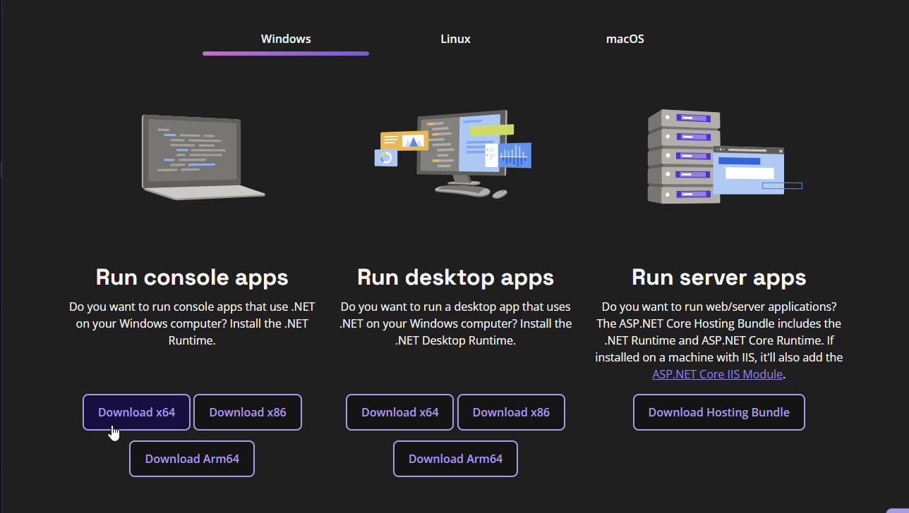

Afterwards, open the installer, and install the runtime.

### Visual Studio 2022

To compile the sdk you will need Visual Studio 2022 installed, you can grab it from [this](https://visualstudio.microsoft.com/vs/) link. A community edition version will suffice. While installing it, make sure to check the following components in the installer:


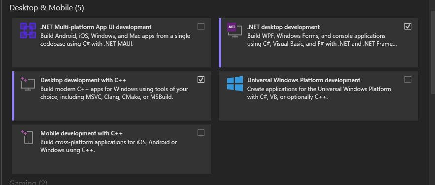
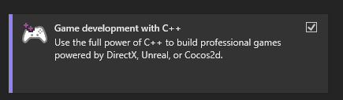

Then press continue, and wait for visual studio to install.


### Unreal Engine 5.1

After installing Visual Studio, we need to install Unreal Engine. To do so, open Epic Games Launcher, and head over to the `Unreal Engine` tab. Here, go to the `Library` tab, and press on the little yellow plus button to add a new version:

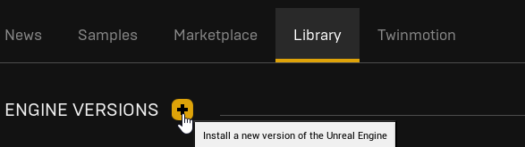

After this, you should see a new card appear with the ability to select an engine version, open the dropdown and select `5.1`, like this:

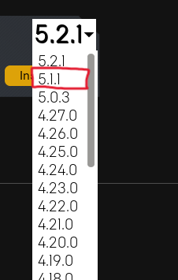

> [!NOTE]
> Any 5.1 version will work, it doesn't matter if it's 5.1 or 5.1.1


### Wwise

Palworld uses Wwise for it's sounds, so we will need to install this too.

> [!IMPORTANT]
> Even if you are not planning on making sounds, you still need wwise, otherwise the project will not compile

To install wwise, go to [this](https://audiokinetic.com/) website, and press `Download Audiokinetic Launcher`:


This will require you to make an account. After downloading the launcher, install it and log in. Head over to the `Wwise` tab. On the bottom of your screen you should see an `Install A New Version` header. Select `2021.1.11` as your wwise version and press install:

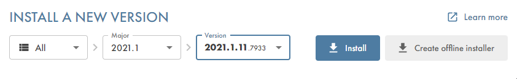

On the next page, select:

* SDK (C++)
* Microsoft -> Windows -> Visual Studio 2022

The selection should look like so:

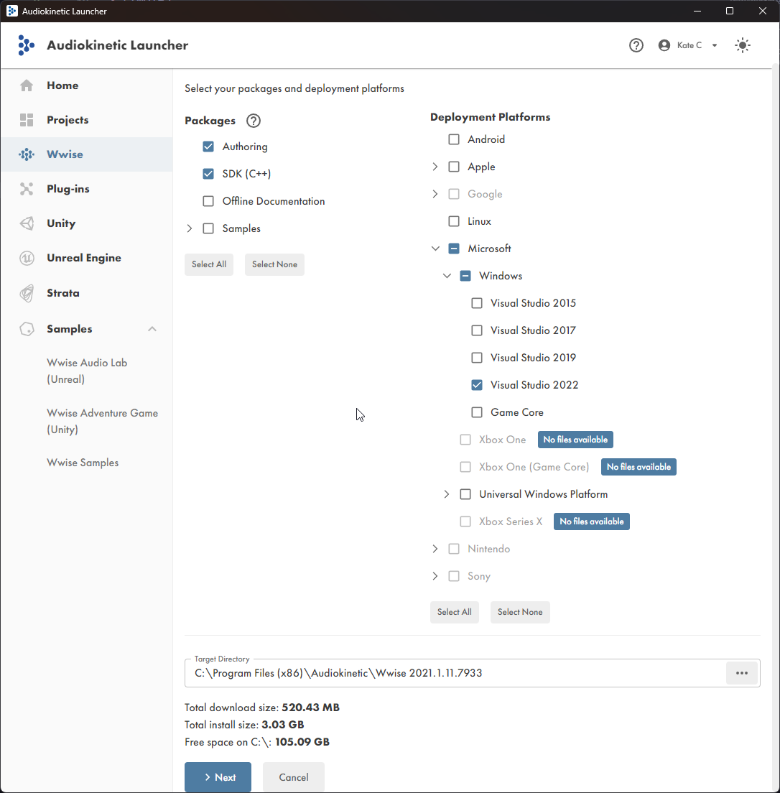

Now press next, on the plugins page you don't need to add any plugins, so hit install!

After installing the Wwise sdk, head over to the `Unreal Engine` tab, there press on the `Download` button, and select `Offline integration files`:

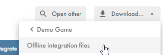

In the integration version, choose the same wwise version you chose when installing the sdk, and remember the download directory, now hit install!

## Sdk download

With the prerequisites out of the way, we are ready to download the sdk. Download this repo using the colored button on the top right, and presss `Download ZIP`:

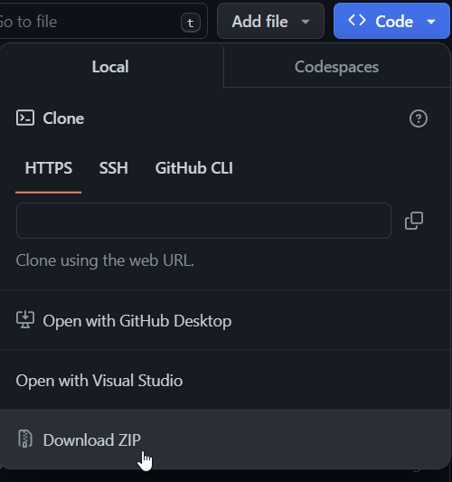

After downloading the repo, unpack it anywhere you want, and you should see the following file structure:

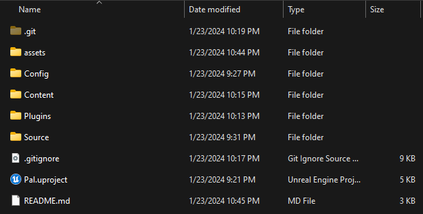

### Wwise integration

Before continuing to open the sdk in unreal, we must integrate wwise manually. This is because the wwise version that the game uses, is not officially compatible with the engine version, so we have to manually copy it over.

Open the directory you downloaded offline installation files for wwise in, you should see the following structure:

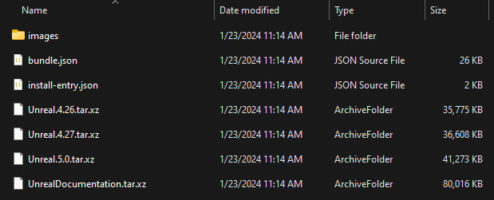

Unpack the `Unreal.5.0.tar.xz` archive.

> [!NOTE]
> You might need to do it twice, first time you unpack it, you might get a .tar file, unpack that one too.

Copy over the unpacked `Wwise` folder into the `Plugins` folder of the SDK.

Almost done with wwise integration, now we just need to copy over the needed dlls.

Open the `Wwise` folder inside of the SDK, and create a `ThirdParty` folder there. 

Now go to the folder where you installed the Wwise SDK

> [!IMPORTANT]
> This is not the folder where you installed the integration files, but the folder where you installed the SDK

For me this path is:

```
C:\Program Files (x86)\Audiokinetic\Wwise 2021.1.11.7933\SDK
```

Inside of this folder, select:

* `Win32_vc170`
* `x64_vc170`
* `include`

And copy over those folders to the `ThirdParty` folder.

After copying over those folders, make sure to duplicate the `vc170` folders as `vc160` also, so the structure will look as follows:


Yay! Now we are done with integrating wwise!

### Changing build tools from VS 2019 to VS 2022
In Unreal Engine 5.1, by default, Visual Studio 2019 build tools will be used if they are installed. 

> [!IMPORTANT]
> The below changes should only be made if Visual Studio 2019 is installed alongside Visual Studio 2022.

To change this, navigate to `%APPDATA%\Unreal Engine\UnrealBuildTool` and open `BuildConfiguration.xml` with your favorite XML editor.

Your initial configuration will look like below:
```xml
<?xml version="1.0" encoding="utf-8" ?>
<Configuration xmlns="https://www.unrealengine.com/BuildConfiguration">
</Configuration>
```

Update the configuration to look like this:
```xml
<?xml version="1.0" encoding="utf-8" ?>
<Configuration xmlns="https://www.unrealengine.com/BuildConfiguration">
    <VCProjectFileGenerator>
        <Version>VisualStudio2022</Version>
    </VCProjectFileGenerator>
    <WindowsPlatform>
        <Compiler>VisualStudio2022</Compiler>
    </WindowsPlatform>
</Configuration>
```

Congratulations on making it through the configuration!

## Launching

After doing all of those steps, we are ready! Double click the `Pal.uproject` file and it should open in Unreal Engine!

> [!NOTE]
> If it tells you that modules are out of date and need to be recompiled, press **YES**

> [!NOTE]
> Wwise will complain about not being compatible with the current Unreal Engine version, just ignore that.


> [!IMPORTANT]
> If the file doesn't open in unreal engine and instead asks you for associations, open Unreal Engine, and open the file from there instead

> [!NOTE]
> You may see a popup on launch about Wwise project path issues, ignore it and press the X in the corner to close the popup.

> [!NOTE]
> You may think nothing is happening, unreal engine has to compile a lot of things in the background before the editor opens. This may take a LONG while.


## What do I do now?

> [!IMPORTANT]
> The next step in the process will be to create a Compatible Blueprint Mod

- [UE4SS Github](github.com/UE4SS-RE/RE-UE4SS)
- [UE4SS Offical Docs](https://docs.ue4ss.com/index.html)
- [Creating A Blueprint Mod Youtube Video](https://www.youtube.com/watch?v=fB3yT85XhVA)  

> [!NOTE]
> Following the above youtube video; when you get to packaging your project, the button is located here:
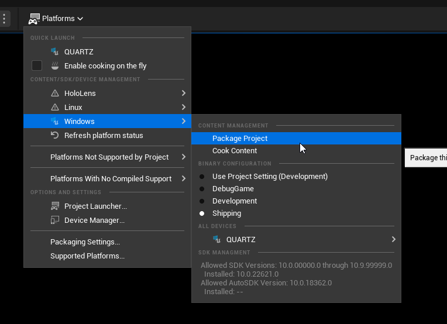

## Help

If you encounter any issues using the SDK, feel free to open an issue, or shoot a message on discord.

[Nebulae Discord](https://discord.gg/Nkb2JHu7wc)

[Palworld Modding Discord](https://discord.gg/qHTZNcvYsv)
